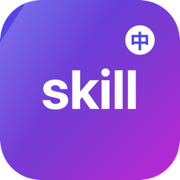

<p align="center">
  
</p>

<h1 align="center">SkillLocalizer / 技能本地化器</h1>

<p align="center">
  <b>中文</b> | <a href="#english">English</a>
</p>

<p align="center">
  
  
  
  
</p>
<p align="center">
  
  
  
  <a href="https://github.com/hwl513782273/SkillLocalizer/releases/latest"></a>
</p>

---

<p align="center">
  <a href="https://github.com/hwl513782273/SkillLocalizer/releases/latest">下载最新版 / Download</a>
  ·
  <a href="https://github.com/hwl513782273/SkillLocalizer/issues">问题反馈 / Issues</a>
</p>

> 一款 macOS 原生的 WorkBuddy 技能本地化工具：批量读取每个 skill 的 `SKILL.md`，把名称、解释与面板标题翻译并写入中文，让英文技能在 WorkBuddy 里也能一眼读懂。/ A native macOS tool to localize WorkBuddy skills: reads every `SKILL.md`, translates each skill's name, description, and panel title into Chinese, so English skills read clearly inside WorkBuddy.

> **作者 Author：banqiu** **许可证 License：MIT**（详见 LICENSE）。可自由使用、修改与再分发，须保留版权与许可声明。

## 中文

### 主要功能

- **技能总览**：自动读取 `~/.workbuddy/skills`，解析每个 `SKILL.md` 的 frontmatter（名称 / 描述 / 面板标题），左侧列表实时展示。
- **分条本地化**：右侧编辑区逐条填写「中文名 / 中文解释 / 中文前缀 / 面板标题」，保存即写入该 skill 目录。
- **英文检测**：一键标记出「原解释仍是英文」的 skill，快速定位未本地化项。
- **翻译此条 / 批量翻译**：调用 AI 接口把原解释自动翻译填入中文解释；可只翻当前筛选结果，也可整批处理。
- **配置导入导出**：「导出所有 skill」与「导出此 skill」打包真实 skill 目录为 zip；「导入配置 / 导出配置」以 JSON 备份与还原本地化设置。
- **一键还原**：「全部恢复最初」可把所有本地化清空，回到 skill 出厂状态。
- **原生离线**：SwiftUI + AppKit 构建，数据全部存于本机（`~/.workbuddy/skills`），不上传云端。

> **平台说明 Platform Note：本工具为 macOS 原生应用（SwiftUI + AppKit，打包为 `.app` / `.dmg`），暂无 Windows / Linux 版本。**

### 快速开始

1. 在 [Releases](https://github.com/hwl513782273/SkillLocalizer/releases/latest) 下载对应系统的 DMG（见下方「macOS 版本选择」）。
2. 打开 DMG，把 `SkillLocalizer.app` 拖入「应用程序」。
3. 首次打开：右键 → 打开（或终端执行 `xattr -dr com.apple.quarantine /Applications/SkillLocalizer.app`）。
4. 启动后在左侧选择 skill，右侧填写中文名/解释，或点「翻译此条」自动翻译，最后点「保存」。

从源码构建（需 macOS 12+ 与 Swift 工具链）：

```
swiftc -O -parse-as-library -target arm64-apple-macosx12.0 main.swift -o .build/arm64/SkillLocalizer \
  -framework SwiftUI -framework AppKit -framework Foundation -framework Security -framework CryptoKit -framework UniformTypeIdentifiers
swiftc -O -parse-as-library -target x86_64-apple-macosx12.0 main.swift -o .build/x86_64/SkillLocalizer \
  -framework SwiftUI -framework AppKit -framework Foundation -framework Security -framework CryptoKit -framework UniformTypeIdentifiers
lipo -create -output SkillLocalizer .build/arm64/SkillLocalizer .build/x86_64/SkillLocalizer
codesign --force --deep --sign - SkillLocalizer
```

打包 DMG（需 hdiutil，macOS 自带）：

```
hdiutil create -volname SkillLocalizer -srcfolder SkillLocalizer.app -ov -format UDZO \
  12-SkillLocalizer-1.1.15-universal.dmg
```

### macOS 版本选择

- **Apple Silicon（M1 及更新）— 推荐**：下载 `12-SkillLocalizer-1.1.15-universal.dmg`（arm64 + x86_64 通用，覆盖 macOS 12+）。
- **Intel Mac（含老系统）**：同样下载 `12-SkillLocalizer-1.1.15-universal.dmg`（通用包已含 x86_64，可跑在 Intel 上）。

> 各档 DMG 均为 ad-hoc 签名、**未公证（notarized）**，首次打开请右键「打开」放行 Gatekeeper。各档均由同一套源码构建，源码零改动。

> 仓库「发行版 / Releases」的命名格式为：`支持最低版本-{软件英文名}-版本-架构`（如 `12-SkillLocalizer-1.1.15-universal.dmg`）。第一段数字为该包实际支持的最低 macOS 版本号。

### 支持的功能

| 类别 | 项目 | 说明 |
|------|------|------|
| 浏览 | 技能列表 | 读取 `~/.workbuddy/skills`，展示每个 skill 的名称、解释、面板标题 |
| 浏览 | 时间排序 | 按「添加时间↓ / 更新日期↓」降序排列，快速定位新增或改动项 |
| 本地化 | 分条编辑 | 中文名 / 中文解释 / 中文前缀 / 面板标题，逐项填写并即时预览 |
| 本地化 | 英文检测 | 标记原解释仍为英文的 skill，聚焦未翻译项 |
| 翻译 | 翻译此条 | 调 AI 接口把当前 skill 原解释自动翻译填入中文解释 |
| 翻译 | 批量翻译 | 仅翻译左侧筛选结果，或整批处理，互不干扰 |
| 备份 | 导出 / 导入 | 导出所有 skill / 导出此 skill 为 zip；导入配置 / 导出配置为 JSON |

### 差异化亮点

- 🗂 **集中管理**：一个窗口统管所有 WorkBuddy 技能的中文名与解释，不必逐个翻 SKILL.md。
- 🤖 **AI 翻译**：内置「翻译此条」，一键把英文原解释翻成中文，省去手动抄写。
- 🔍 **英文检测**：自动标出仍是英文的 skill，本地化进度一目了然。
- 📦 **目录级导出**：导出真实 skill 目录为 zip，换机迁移直接解压即用。
- ↩️ **一键还原**：「全部恢复最初」清空所有本地化，回到出厂状态无负担。
- 🔒 **本地优先**：数据全在本机 `~/.workbuddy/skills`，不上传云端，隐私可控。

### 已知限制

- **未公证**：DMG 为 ad-hoc 签名、未经过 Apple 公证，首次打开需右键「打开」放行 Gatekeeper（或 `xattr -dr` 移除隔离标记）。这并非故障。
- **仅限 WorkBuddy**：当前固定读取 `~/.workbuddy/skills` 的 SKILL.md 格式；其他框架（如 Claude Code、Zcode GPT）的技能目录结构不同，需自行映射路径后才能复用。

## English

### Highlights

- Centralized manager: one window for every WorkBuddy skill's Chinese name & description.
- AI translation: "Translate this item" turns the English original into Chinese in one click.
- English detection: flags skills whose description is still English, so progress is visible at a glance.
- Directory-level export: exports the real skill folder as a zip — migrate to a new machine by unzipping.
- One-click restore: "Restore all to original" wipes every localization and returns to factory state.
- Local-first: everything stays in `~/.workbuddy/skills` on your Mac; nothing is uploaded.

> **Platform Note: this is a native macOS app (SwiftUI + AppKit, packaged as `.app` / `.dmg`). There is no Windows / Linux build.**

### Quick start

1. Download `12-SkillLocalizer-1.1.15-universal.dmg` from [Releases](https://github.com/hwl513782273/SkillLocalizer/releases/latest) (see "Choose a macOS build" below).
2. Open the DMG and drag `SkillLocalizer.app` into "Applications".
3. First launch: right-click → Open (or run `xattr -dr com.apple.quarantine /Applications/SkillLocalizer.app`).
4. Pick a skill on the left, fill in the Chinese name/description (or hit "Translate this item"), then click "保存 / Save".

Build from source (requires macOS 12+ and the Swift toolchain):

```
swiftc -O -parse-as-library -target arm64-apple-macosx12.0 main.swift -o .build/arm64/SkillLocalizer \
  -framework SwiftUI -framework AppKit -framework Foundation -framework Security -framework CryptoKit -framework UniformTypeIdentifiers
swiftc -O -parse-as-library -target x86_64-apple-macosx12.0 main.swift -o .build/x86_64/SkillLocalizer \
  -framework SwiftUI -framework AppKit -framework Foundation -framework Security -framework CryptoKit -framework UniformTypeIdentifiers
lipo -create -output SkillLocalizer .build/arm64/SkillLocalizer .build/x86_64/SkillLocalizer
codesign --force --deep --sign - SkillLocalizer
```

Package the DMG (requires hdiutil, bundled with macOS):

```
hdiutil create -volname SkillLocalizer -srcfolder SkillLocalizer.app -ov -format UDZO \
  12-SkillLocalizer-1.1.15-universal.dmg
```

### Choose a macOS build

- **Apple Silicon (M1 and later) — Recommended**: download `12-SkillLocalizer-1.1.15-universal.dmg` (universal arm64 + x86_64, macOS 12+).
- **Intel Mac (incl. older systems)**: also download `12-SkillLocalizer-1.1.15-universal.dmg` (the universal build includes x86_64).

> All DMGs are ad-hoc signed and **not notarized**. Right-click → Open on first launch to pass Gatekeeper. All variants are built from the same source with zero modification.

> Release naming format: `minimum-macOS-version-{软件英文名}-version-arch` (e.g. `12-SkillLocalizer-1.1.15-universal.dmg`).

### Supported features

| Category | Item | Description |
|----------|------|-------------|
| Browse | Skill list | Reads `~/.workbuddy/skills`, shows each skill's name, description, panel title |
| Browse | Time sort | Sort by "added ↓ / updated ↓" to spot new or changed skills |
| Localize | Per-item edit | Chinese name / description / prefix / panel title, with live preview |
| Localize | English detection | Flags skills whose description is still English |
| Translate | Translate this item | Calls an AI endpoint to fill the Chinese description automatically |
| Translate | Batch translate | Translates only the filtered list, or the whole batch |
| Backup | Export / Import | Export all / this skill as zip; import / export config as JSON |

### Why this tool

- 🗂 **Centralized**: manage every skill's Chinese name & description in one window.
- 🤖 **AI translation**: one click to turn the English original into Chinese.
- 🔍 **English detection**: instantly see which skills are still untranslated.
- 📦 **Directory export**: real skill folders packed as zip — unzip on a new machine to migrate.
- ↩️ **One-click restore**: wipe all localizations and return to factory state.
- 🔒 **Local-first**: data stays in `~/.workbuddy/skills`; nothing leaves your Mac.

### Known limitations

- **Not notarized**: DMGs are ad-hoc signed and not Apple-notarized; right-click → Open on first launch (or `xattr -dr` to clear the quarantine flag). This is expected, not a bug.
- **WorkBuddy only**: currently fixed to `~/.workbuddy/skills` and the SKILL.md format. Other frameworks (Claude Code, Zcode GPT) use different layouts and need path mapping before reuse.

## 隐私与安全 / Privacy and security

- **本地运行 / 不上传**：所有本地化数据仅存于本机 `~/.workbuddy/skills`，应用不联网、不上传任何内容。/ All localization data stays on your Mac in `~/.workbuddy/skills`; the app makes no network calls and uploads nothing.
- **权限透明**：AI 翻译需在设置中填入接口 Key（存系统钥匙串），密钥不写入仓库或配置文件；你可随时删除。/ Translation keys are stored in the system Keychain and never written to the repo or config files; you can remove them anytime.
- **未公证提醒**：应用未经过 Apple 公证，请仅从你信任的来源（本仓库 Releases）获取，并在首次打开时右键放行。/ The app is not Apple-notarized; get it only from a trusted source (this repo's Releases) and right-click → Open on first launch.

## 许可证 / License

> **MIT License** — 版权归 **banqiu** 所有（2026）。
>
> - 允许个人与商业免费使用、修改、再分发，须保留版权与许可声明。
> - 完整条款见 [LICENSE](https://github.com/hwl513782273/SkillLocalizer/blob/main/LICENSE)。

## 支持 / Support

技能本地化器 是一款免费开源工具，基于 MIT 许可发布，离线、无广告。如果你觉得好用，欢迎在 GitHub 上点个 Star，或反馈问题 / 提交 PR 帮它变得更好 —— 纯自愿。 SkillLocalizer is free, open-source, and ad-free. If it helps you, a GitHub Star or an issue/PR is warmly welcome — entirely optional.
