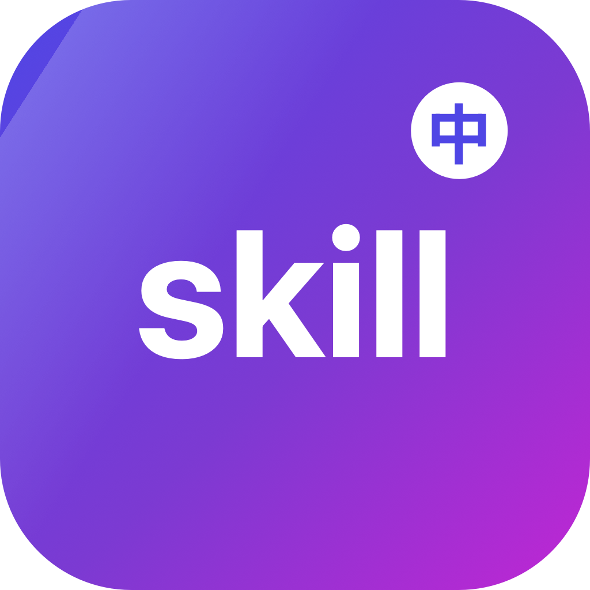

# SkillLocalizer / 技能本地化器

> 一款 macOS 原生的 WorkBuddy 技能本地化工具，借助 AI 批量翻译，将每个 skill 的名称、解释与面板标题中文化。/ A native macOS tool to localize WorkBuddy skills — translates each skill's name, description, and panel title into Chinese, with AI-powered batch translation.

> **作者 Author：banqiu**
> **许可证 License：MIT**（详见 LICENSE）。可自由使用、修改与再分发，须保留版权与许可声明。

<p align="center"></p>

[下载最新版 / Download](https://github.com/hwl513782273/SkillLocalizer/releases/latest) · [问题反馈 / Issues](https://github.com/hwl513782273/SkillLocalizer/issues)

---

## 中文

### 主要功能
- 读取 `~/.workbuddy/skills`，自动解析每个 `SKILL.md` 的 frontmatter（名称 / 描述 / 面板标题）。
- 左侧列表 + 右侧编辑：逐条填写「中文名 / 中文解释 / 中文前缀 / 面板标题」，所见即所得。
- AI 批量翻译：支持 **硅基流动 SiliconFlow**、**智谱 Zhipu**、**自定义 OpenAI 兼容端点**、**百度翻译开放平台（传统 API，MD5 签名）** 四类接口。
- 凭证按接口隔离：每个接口的 Key 存系统钥匙串、Base/Model 存 UserDefaults（按预设后缀隔离），互不串用。
- 网络诊断可视化：超时（60s）、原始错误码（如 `-1001`）、耗时、自动识别系统 / 环境变量代理。
- 英文检测：标记「原本是英文且当前仍显示英文」的 skill；侧栏显示「仍有 N 个含英文解释」，可勾「英文」快速筛选。
- 批量翻译只翻左边筛选出的：勾「英文」→ 只翻那一列；搜索 → 只翻匹配项。
- 详情显示「添加日期」（目录创建时间）与「安装来源」；AI 自创建的 skill 显示「workbuddy 生成」。
- 配置导出 / 导入（JSON）：导入重合项先自动备份原配置（可还原）再载入为待保存（保存才执行）。
- 原生 SwiftUI / AppKit 单文件 App，拖入「应用程序」即用，**macOS 12+ 通用（arm64 + x86_64）**。

### 快速开始
1. 在 Releases 下载 `12-SkillLocalizer-1.1.15-universal.dmg`（见下方「macOS 版本说明」）。
2. 打开 DMG，把 `SkillLocalizer.app` 拖入「应用程序」。
3. 首次打开：右键 → 打开（或终端执行 `xattr -dr com.apple.quarantine /Applications/SkillLocalizer.app`）。
4. 在「设置」里选翻译接口并填入对应 API Key，保存后即可批量 / 逐条翻译。

从源码构建（需 macOS 12+ 与 Swift 工具链）：
```bash
swiftc -O -parse-as-library -target arm64-apple-macosx12.0 \
  -framework SwiftUI -framework AppKit -framework Foundation \
  -framework Security -framework CryptoKit -framework UniformTypeIdentifiers \
  main.swift -o SkillLocalizer.app/Contents/MacOS/SkillLocalizer
codesign --force --deep --sign - SkillLocalizer.app
```

打包 DMG：
```bash
hdiutil create -format UDZO -volname SkillLocalizer \
  -srcfolder SkillLocalizer.app 12-SkillLocalizer-1.1.15-universal.dmg
```
（也可直接 `bash build.sh` 一步完成上面两步。）

### macOS 版本说明
- **Apple Silicon + Intel 通用（推荐）**：下载 `12-SkillLocalizer-1.1.15-universal.dmg`，同时包含 arm64 + x86_64，macOS 12.0+ 通吃。

> 该 DMG 为 ad-hoc 签名、**未公证（notarized）**，首次打开请右键「打开」放行 Gatekeeper；在 Apple Silicon 上 Intel 版需通过 Rosetta 2 运行。源码经 `-target` 注入构建，零改动。

> 仓库「发行版 / Releases」的命名格式为：`支持最低版本-SkillLocalizer-版本-架构`（如 `12-SkillLocalizer-1.1.15-universal.dmg`）。

### 筛选与检测说明

| 类别 | 项 | 说明 |
|---|---|---|
| 筛选 | 搜索 | 按名称 / 路径搜索 skill |
| 筛选 | 仅改 | 只看已修改的 skill |
| 筛选 | 英文 | 只看「原本是英文且当前仍显示英文」的 skill |
| 检测 | 英文解释 | 不含中文字符且 ≥3 个英文字母判为英文；改过成中文 / 中英混排的不计入 |
| 详情 | 添加日期 | 该 skill 目录在本机的创建时间 |
| 详情 | 安装来源 | AI 自创建显示「workbuddy 生成」；否则按市场 / GitHub / Git / 本地判定 |

### 差异化亮点
- 🌐 **AI 批量中文化**：把每个 skill 的名称 / 解释 / 面板标题一键翻成中文，告别英文面板。
- 🔌 **多接口兼容**：硅基流动 / 智谱 / 自定义 OpenAI 兼容 / 百度传统 API，一个 Key 搞定。
- 🔒 **凭证隔离**：每个接口的 Key 独立存钥匙串，互不串用，换接口不掉 Key。
- 🧭 **英文一目了然**：自动标出「仍是英文」的 skill，批量翻译只翻筛出来的，效率拉满。
- 📦 **原生单文件 App，零依赖**：拖入「应用程序」即用，无 install 脚本、无后台进程。
- 💾 **配置可迁移**：导出 / 导入 JSON，换机不丢本地化成果；导入重合自动备份可还原。
- 💻 **一份源码，Apple Silicon + Intel**：macOS 12+ 通用构建。

### 已知限制
- AI 翻译需要你自备对应接口的 API Key（密钥仅存本地钥匙串，不离开你的 Mac，只调用你配置的翻译端点）。
- 应用未公证（notarized），首次打开请右键「打开」放行 Gatekeeper。
- 若某 skill 在本 App 扫描前就已被本地化成中文，`trueOrigDesc` 会记成中文原值，该 skill 的「英文」判定会漏（App 无法凭空恢复已覆盖的英文）。

---

## English

### Highlights
- Reads `~/.workbuddy/skills` and parses each `SKILL.md` frontmatter (name / description / panel title).
- Left list + right editor: fill in "Chinese name / Chinese description / Chinese prefix / panel title" per skill, WYSIWYG.
- AI batch translation: **SiliconFlow**, **Zhipu**, **custom OpenAI-compatible endpoint**, and **Baidu Translate Open Platform (classic API, MD5-signed)**.
- Per-provider credential isolation: each provider's key lives in the system Keychain, Base/Model in UserDefaults (suffixed per preset) — they never cross-talk.
- Visual network diagnostics: 60s timeout, raw error codes (e.g. `-1001`), latency, auto-detected system / env-proxy.
- English detection: flags skills that "were originally English and are still English"; sidebar shows "N skills still have English descriptions", with an "English" filter toggle.
- Batch translate only the filtered left list: toggle "English" → translate just that column; search → translate just matches.
- Detail shows "Added date" (directory creation time) and "Install source"; AI-created skills show "workbuddy 生成".
- Config export / import (JSON): on import, overlapping items are auto-backed-up first (restorable) then loaded as pending-save (save-to-apply).
- Native SwiftUI / AppKit single-file app — drag into Applications and it just works; **macOS 12+ universal (arm64 + x86_64)**.

### Quick start
1. Download `12-SkillLocalizer-1.1.15-universal.dmg` from Releases (see "macOS build notes" below).
2. Open the DMG and drag `SkillLocalizer.app` into Applications.
3. First launch: right-click → Open (or run `xattr -dr com.apple.quarantine /Applications/SkillLocalizer.app` in Terminal).
4. In "设置 / Settings", pick a translation provider and enter its API Key; save, then batch / per-skill translate.

Build from source (requires macOS 12+ and the Swift toolchain):
```bash
swiftc -O -parse-as-library -target arm64-apple-macosx12.0 \
  -framework SwiftUI -framework AppKit -framework Foundation \
  -framework Security -framework CryptoKit -framework UniformTypeIdentifiers \
  main.swift -o SkillLocalizer.app/Contents/MacOS/SkillLocalizer
codesign --force --deep --sign - SkillLocalizer.app
```

Build the DMG:
```bash
hdiutil create -format UDZO -volname SkillLocalizer \
  -srcfolder SkillLocalizer.app 12-SkillLocalizer-1.1.15-universal.dmg
```
(Or just run `bash build.sh` to do both in one step.)

### macOS build notes
- **Apple Silicon + Intel (recommended)**: use `12-SkillLocalizer-1.1.15-universal.dmg` (contains both arm64 + x86_64, universal, macOS 12.0+).

> This DMG is ad-hoc signed and **not notarized**; right-click "Open" on first launch to bypass Gatekeeper. The Intel build runs on Apple Silicon via Rosetta 2. Built from the same source via `-target` injection — zero source changes.

> Release asset naming: `min-version-SkillLocalizer-version-arch` (e.g. `12-SkillLocalizer-1.1.15-universal.dmg`).

### Filter & detection reference

| Category | Item | Description |
|---|---|---|
| Filter | Search | Search skills by name / path |
| Filter | Modified only | Show only modified skills |
| Filter | English | Show only skills that were originally English and are still English |
| Detection | English description | No CJK char + ≥3 ASCII letters ⇒ English; edited-to-Chinese / mixed don't count |
| Detail | Added date | The skill directory's creation time on this machine |
| Detail | Install source | AI-created shows "workbuddy 生成"; otherwise market / GitHub / Git / local |

### Why this tool
- 🌐 **AI batch localization**: turn every skill's name / description / panel title into Chinese in one pass — say goodbye to English panels.
- 🔌 **Multi-provider**: SiliconFlow / Zhipu / custom OpenAI-compatible / Baidu classic API, one key each.
- 🔒 **Credential isolation**: each provider's key is stored separately in the Keychain — switching providers never drops your key.
- 🧭 **English at a glance**: auto-flags "still English" skills; batch translate only touches the filtered list.
- 📦 **Native single-file app, zero dependencies**: drag into Applications and it just works; no install scripts, no background daemons.
- 💾 **Portable config**: export / import JSON so you never lose localization work when switching machines; overlapping imports are auto-backed-up first.
- 💻 **One codebase, Apple Silicon + Intel**: universal macOS 12+ build.

### Known limitations
- AI translation requires your own API Key for the chosen provider (stored only in the local Keychain, never leaves your Mac except to call the endpoint you configure).
- The app is not notarized; right-click "Open" on first launch to bypass Gatekeeper.
- If a skill was already localized to Chinese before this app scanned it, `trueOrigDesc` records the Chinese value, so its "English" detection is missed (the app can't recover overwritten English).

---

## 隐私与安全 / Privacy and security
- 纯本地运行；API Key 存于系统钥匙串，仅在你点「测试连接 / 翻译」时调用你配置的翻译端点，不上传其他任何数据。
- 应用未公证（notarized），请仅从你信任的来源获取，并在首次打开时右键放行。

---

## 许可证 / License
**MIT License** — 版权归 **banqiu** 所有（2026）。
- 允许个人与商业免费使用、修改、再分发，须保留版权与许可声明。
- 完整条款见 [LICENSE](LICENSE)。

---

## 支持 / Support
SkillLocalizer 是一款免费开源工具，基于 MIT 许可发布，离线、无广告。如果你觉得好用，欢迎在 GitHub 上点个 Star，或反馈问题 / 提交 PR 帮它变得更好 —— 纯自愿。 This tool is free, open-source, and ad-free. If it helps you, a GitHub Star or an issue/PR is warmly welcome — entirely optional.
